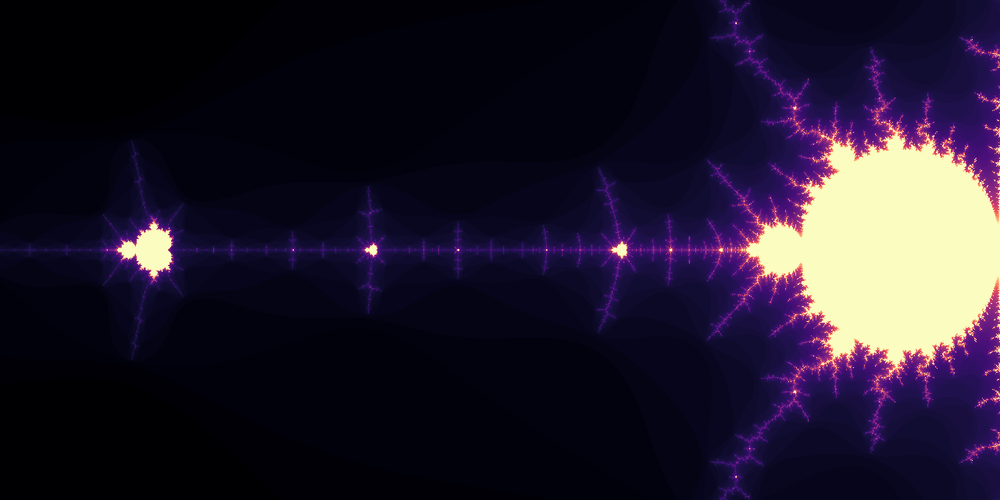

# fractal
Experiments with fractals generated in numba/cuda for fun and learning.

The repository contains code written for my small study group when learning about CUDA and GPU processing. I'm sharing it publicly because someone might find it helpful.

In general, CUDA kernels are written using numba. Code is in plain `*.py` files as I encountered errors when running it from notebooks.

For dependency management, I use poetry.

Currently, it contains:
* `01-python-mandelbrot.ipynb` - a notebook with generating Mandelbrot set in pure python.
* `fractal/cuda_tutorial_01.py` - copying data from/to device and running a kernel.
